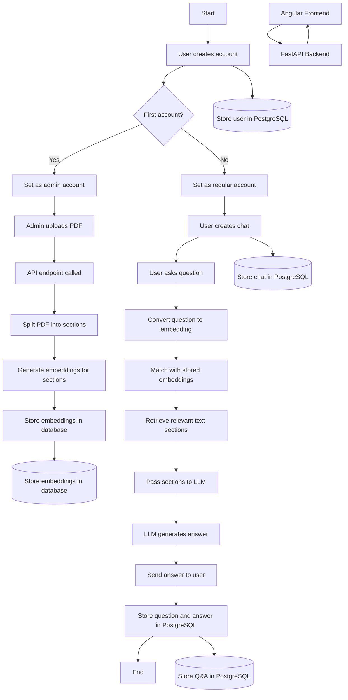
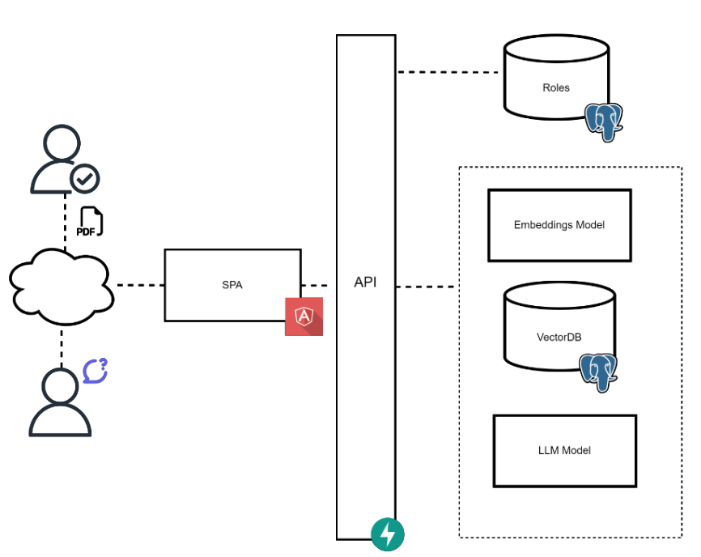
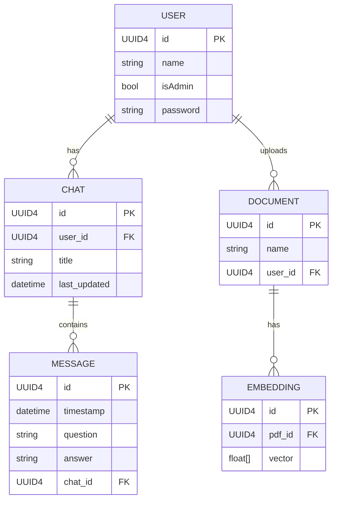

# PDF-Chat Documentation

# Info

This is the documentation of PDF-Chat programmed by @SAUL ARIEL CASTAÑEDA and @Linus Dehner.

PDF Chat is a easy to use locally hosted application in which you can upload PDFs and then create chats and ask questions about them.  

## Tech stack

- Frontend
    - [Angular 18](https://angular.dev/)
    - [Bootstrap 5](https://getbootstrap.com/)
- Backend
    - [Pyhon](https://www.python.org/)
    - [LangChain](https://python.langchain.com/docs/introduction/)
    - [FastAPI](https://fastapi.tiangolo.com/) (API Framework)
    - [SQLAlchemy](https://www.sqlalchemy.org/) (ORM)
- Database
    - [PostgreSQL](https://www.postgresql.org/)
- Model (if local only version is used)
    - [Ollama wizardlm2:7b](https://ollama.com/library/wizardlm2:7b)

## Application architecture

Our application is designed that our angular frontend can interact with our FastAPI written in python. At the beginning, a user can create an account. The first account, which is registered, is always an admin account. After that the admin can upload a PDF and then the API endpoint will be called which will generate embeddings for this PDF. To generate the embeddings, we first split up the pdf into multiple sections. After that, for each sections, embeddings are generated with an overlap, so we reduce the risk of information loss. Every user can create multiple chats, which will be stored in an PostgreSQL database, as will the users themselves. After a chat created, the user can ask questions about all pdf stored in the system. After the question was sent to the backend, we will translate the question into embeddings. Then we match the embedding generated out of the message to the embeddings store in the database. After we found matching embeddings we will fetch the corresponding sections of text. To generate the response the selected sections will be given to a large language model which then will generate an answer. This answer will be sent back as the answer for the question of the user.

### Flow Chart



### Application



## Links

- [Online Documentation](https://www.notion.so/11b4e24b3db780babf0dcc16fd36ab45?pvs=21)
- [Git Repo](https://github.com/ldehner/pdf-chat) (Source code)

---

# Backend

## RAG

When we decided to implement this project we found two totally different paths to follow. One was selecting an implemented LLM Model, finding a dataset that adjust to a certain product domain and then fine-tuning the model to achieve more domain-specific answers when asking questions about some product. The thing is that this solution was not as general as we wanted. The main purpose of our project was to facillitate companies the process of providing AI based responses to their customers. However, selecting specific dataset and probably creating new ones with even more specific data based on companies PDFs would definitively envolved a high complex process that could perhaps solved the problem, also maybe with high accuracy, but not very resource efficiently. 

In view of this complexity, on the other hand, we have the possibility to develop a solution that can be applied to many different companies in different sectors. Even though we cannot say with certainty that using a RAG architecture is more resource-efficient than the other option, the idea of using a general model without having to fine-tune it and generate specific data sets was what made us select this method.

Going deeper into this Architecture, there are different components involved, but two of them require special attention. Both components are LLM Models, but one is responsible of calculating embeddings associated to the different document parts, while the other of generating the response given the original user’s query and the retrieved most relevant content found it in the documents.

Consequently, the usage of large paragraphs with content plus the user’s query and the required prompt to combine both needs a high number of tokens to be send to the model. This is the reason why we cannot assure that, despite not having to create specific datasets and fine-tuning, this method is more efficiently than the other. Moreover if we consider that all this content has to be send to the model for each query. Perhaps there are some improvements in this area that can let the process be more efficient, but those are aspects that we decide to not explore in the development of this project.

Regarding the code, we follow and adapt to our needs the code provided by Langchain in their [Build a Retrieval Augmented Generation (RAG) App](https://python.langchain.com/docs/tutorials/rag/) tutorial. This tutorial mentions Embeddings model, which we will explore in the next section.

### Embeddings

At the begining of our project we decided to focus on one of the mentioned two models involved in the RAG Architecture. As the generative model implies a high resource-demanding development, we select the embeddings development. 

Originally we were interested in developing our own embeddings model or at least fine-tuning one, but the complexity of the whole projects demand us to discard this idea and focus in bigger aspects of the application, like prompt engineering for better results and testing them. However, the research made bring us many learnings, from how embeddings work to many different algorithms.

Briefly, embeddings are crucial for our application, as they are responsible for understanding the context of the words in the sentence and assigning a vector representation that is highly contextualized. This basically allows us to find the most similar or relevant content related to the documents by using an specific vector comparison method, which usually is cosine similarity. Also, regarding the models, we can classify them in three, from less to more contextualized embeddings they are:

- Word2vec: MLP neural network. Two versions: continuous bag of words (CBOW) or continuously sliding skip-gram
- ElMo: Uses a BiLSTM neural network, achieving better understanding by analyzing both sides of the sentence given a certain word.
- BERT: Uses transformers.

We highly consider in implementing our own ElMo, but as mentioned before, we end just learning about the topic and we finally use already implemented embeddings models like Gemini or Ollama using the langchain library.

### Large Language Models

The first idea of this application was to have a local only running application which can answer questions based on PDFs. In the process we noticed that you actually need quite a lot of commuting power to be unable to do that so we added another version of this app where you can use either OpenAI or Gemini. 

Our first try with the local model were really slow. After some more research, we knew that we had to map our GPU to the Docker container running Ollama. This is done via the Docker-Compose file. Adding the GPU to the container already speeded up or results by a lot. So instead of 20 seconds to generate an answer, we just needed 1-2 seconds. Then we noticed that after a few minutes the model we needed to reload and was unresponsive for 2-3 minutes. So in our final version we added a preload on application startup. This slows down the startup, because the backend has to wait till the Ollama container is up and running, which takes about 2 minutes on our test machine, but after that you have a way better user experience. Also we added an extra parameter. Also we had to enforce with an extra parameter that the model doesn’t get unloaded after the standard time of 5 minutes without activity.

On our count we received about 200 token in around 2 seconds, which gives us a even faster response than ChatGPT 4o with a average response time of 1 second per 63 tokens.

This great result is also achieved because we used powerful hardware:

- CPU
    - AMD Ryzen 5 7600X
    - 4.70 GHz
- GPU
    - Nvidia GeForce 4070 TI SUPER
    - 16GB VRAM
- RAM
    - 32GB DDR5

## API

To get started quite fast we decided to use FastAPI- an easy to use python API library. Our API is split up into three main components - users, documents and chats. One controller for each main domain. Due to the short time span we had, we focused on the most important endpoints, without any fancy cosmetic features.

### Users

1. **POST / (Create User)**:
    - **Route**: `@router.post("/", status_code=201, response_model=UserModel)`
    - **Function**: `create_user`
    - **Description**: This endpoint is used to create a new user.
    - **Input**: Expects a `UserModel` object containing the user details.
    - **Process**:
        - Prints the user data for debugging.
        - Calls `user_logic.register_user(user)` to register the user.
        - If an error occurs during database interaction (`SQLAlchemyError`), it raises an HTTP 400 error with a message "Error occurred while creating user."
    - **Response**: Returns the created user data on success (HTTP 201).
2. **GET /{username}/{password} (Login User)**:
    - **Route**: `@router.get("/{username}/{password}")`
    - **Function**: `login_user`
    - **Description**: This endpoint is used for user login.
    - **Input**: Takes `username` and `password` as URL parameters.
    - **Process**:
        - Calls `user_logic.login_user(username, password)` to authenticate the user.
        - If the credentials are invalid, it raises an HTTP 401 error ("User unauthorized").
        - If a database error occurs, it raises an HTTP 400 error ("Error logging in user").
    - **Response**: Returns the user data upon successful login.

### Documents

- **Route**: `@router.post("/")`
- **Function**: `create_document`
- **Description**: This endpoint allows a user to upload a document and creates embeddings for it asynchronously.
- **Parameters**:
    - `background_tasks`: A `BackgroundTasks` object used to execute long-running tasks in the background.
    - `user_id`: A `UUID` passed via a form field (`Form(...)`) to identify the user.
    - `file`: The document to be uploaded, passed as an `UploadFile` via form data (`File(...)`).
- **Process**:
    1. Calls `DocumentsService.add_document(file, user_id)` to add the uploaded document for the specified user.
    2. Adds a background task to generate embeddings for the document by calling `DocumentsService.generate_embeddings(document)` without blocking the main thread.
- **Response**:
    - Returns a response with an HTTP 201 status code indicating the document was successfully created.
    - The response includes a `Location` header pointing to the newly created document's resource URL (`/documents/{document.id}`).

### Chats

1. **POST / (Create Chat)**:
    - **Route**: `@router.post("/")`
    - **Function**: `create_chat`
    - **Description**: This endpoint is used to create a new chat.
    - **Input**: Expects a `ChatModel` object containing chat details.
    - **Process**:
        - Prints the chat data for debugging.
        - Calls `chat_logic.create_chat(chat)` to create the chat.
        - If an error occurs during database interaction (`SQLAlchemyError`), it raises an HTTP 400 error with a message "Error occurred while creating chat."
    - **Response**: Returns the created chat data on success.
2. **POST /{id}/messages (Create Message)**:
    - **Route**: `@router.post("/{id}/messages")`
    - **Function**: `create_message`
    - **Description**: This endpoint is used to add a message to an existing chat.
    - **Input**:
        - `id`: A `UUID4` representing the chat's unique identifier.
        - `message`: A `MessageModel` object containing the message details.
    - **Process**:
        - Prints the message data for debugging.
        - Calls `chat_logic.create_message(id, message)` to add the message to the chat with the specified ID.
        - If an error occurs during database interaction (`SQLAlchemyError`), it raises an HTTP 400 error with a message "Error occurred while creating chat."
    - **Response**: Returns the created message with the models answer on success.

## Database

Database wise we decided to use PostgreSQL in combination with a python ORM library called SQLAlchemy. This allows us to store the embeddings vector easily with a PSQL plugin called pgvector. With the ORM we were able to create models in python which made it easy to create the database on docker start. Also this makes it much more easy to store and read from the database.  

To make the application more modular we used the repository pattern to create interchangeable modules with CRUD operations for each model. 

### DB Diagram



### Models

**1. `UserModel`**

The `UserModel` represents the users in the system.

- **Fields**:
    - `id` (Optional[UUID4]): A unique identifier for the user.
    - `name` (str): The name of the user.
    - `isAdmin` (bool): A boolean flag indicating if the user is an admin.
    - `chats` (Optional[List[ChatModel]]): A list of chats associated with the user. Admins can have multiple chats.
    - `password` (Optional[str]): The password for the user, which may or may not be included depending on the context (e.g., during authentication).
- **Relationships**:
    - A user can have multiple chats (`One-to-Many` relationship with `ChatModel`).
    - A user can upload multiple documents (`One-to-Many` relationship with `DocumentModel`).

**2. `ChatModel`**

The `ChatModel` represents a conversation or chat session between a user and the system.

- **Fields**:
    - `id` (Optional[UUID4]): A unique identifier for the chat.
    - `user_id` (UUID4): The ID of the user who owns this chat.
    - `title` (str): The title of the chat (e.g., descriptive of the conversation).
    - `last_updated` (Optional[datetime]): The last time the chat was updated.
    - `messages` (Optional[List[MessageModel]]): A list of messages that are part of this chat.
- **Relationships**:
    - A chat can have multiple messages (`One-to-Many` relationship with `MessageModel`).

**3. `MessageModel`**

The `MessageModel` represents an individual message exchanged in a chat session.

- **Fields**:
    - `id` (Optional[UUID4]): A unique identifier for the message.
    - `timestamp` (Optional[datetime]): The time the message was created.
    - `question` (str): The user's question or message content.
    - `answer` (Optional[str]): The system's response to the user's question.
    - `chat_id` (UUID4): The ID of the chat that this message belongs to.
- **Relationships**:
    - A message belongs to a chat (`Many-to-One` relationship with `ChatModel`).

**4. `DocumentModel`**

The `DocumentModel` represents a PDF or document uploaded to the system by a user.

- **Fields**:
    - `id` (Optional[UUID4]): A unique identifier for the document.
    - `name` (str): The name or title of the document.
    - `user_id` (UUID4): The ID of the user who uploaded the document.
    - `embeddings` (Optional[List[EmbeddingModel]]): A list of embeddings generated from the document.
- **Relationships**:
    - A document can have multiple embeddings (`One-to-Many` relationship with `EmbeddingModel`).
    - A document is associated with a user who uploads it (`Many-to-One` relationship with `UserModel`).

**5. `EmbeddingModel`**

The `EmbeddingModel` represents a vectorized representation (embedding) of a document's content. These embeddings are used for document retrieval and question-answering tasks.

- **Fields**:
    - `id` (Optional[UUID4]): A unique identifier for the embedding.
    - `pdf_id` (UUID4): The ID of the document the embedding belongs to.
    - `vector` (List[float]): A list of floating-point numbers representing the embedding vector.
- **Relationships**:
    - An embedding belongs to a document (`Many-to-One` relationship with `DocumentModel`).

This structure outlines how users interact with chats and documents, how messages flow within chats, and how document embeddings support question-answering functionality.

---

# Testing

Before starting with the description of our testing approach for the core component of our application, it is worth mentioning a few words about AI systems in general.

Testing is crucial for the proper performance of software systems. However, most common and well-known testing approaches are based on asserting whether the specific component (or components) of the application are returning (or behaving in) the expected results. This brings us to the main problem with testing LLMs, which is how it can be determined if the response is the expected one when LLMs can generate correct answers using different words.

## LLM as a Judge - Our testing approach

For sure there are many different approaches to handle the described diffuculty, but we will focus on the testing method used for this project  which is call “LLM as a Judge”.

Briefly, this technique consists on using a LLM model to evaluate, given the content used for generating the response, whether it included statements which can be find in the context or others that may be part of the general knowdlege of the tested model, which can be useful or not.

Going a step deeper, below is described the different stages as well as our results and learnings in the process of testing our RAG Architecture. We took most of the code and techniques from the Medium article [“How to effectively evaluate your RAG + LLM applications”](https://medium.com/@vndee.huynh/how-to-effectively-evaluate-your-rag-llm-applications-2139e2d2c7a4) and we adapted it to our code.

### Step 0: Defining the models

Before the actuall process of testing it is necessary to determine which model we will be testing. As we mentioned in previous sections, the RAG Architectures involves two elemental models, one responsible for generating the embeddings and the other for generating the response.  For our project, due to the constraints regarding compute power when running local models like `Ollama`, we decided to test the accuracy of the system by using online models. We used the langchain embeddings wrapper for Gemini model called `GoogleGenerativeAIEmbeddings` which uses the `models/embedding-001` model. Regarding the generative model, we used langchain wrapper `ChatGoogleGenerativeAI` with the `gemini-1.5-pro` model.

However, there still be the judge model that has not be mentioned. Definitively the election of this model should be at least of one being as good as the chosen generative model and preferably not the same one. Nevertheless, in view of the already required usage of api keys for the Gemini’s models and our learning approach for the whole project, we decided to use the same model.

### Step 1: QA Dataset

Once the models are defined, the first step in the process is generating a dataset of questions and answers based on a given document. In our solution, we decided to use the [“AWS User guide”](https://docs.aws.amazon.com/pdfs/SetUp/latest/UserGuide/setup-guide.pdf) as testing document and again `ChatGoogleGenerativeAI` as the generative model for the questions and answers. Furthermore, it is worthing to mentioned the importance of good prompts to achieve the desired result. Our prompt can be find under the `dataset.py` file inside the test package of the backend module in the source code of this project.

One last thing to mention before moving to the next step, is the election of the chunks size of the document. For this purpose, the following code snipet using the Langchain documents splitter should illuminate our decision in this topic. It should be bare in mind to use the same sizes it will be used in the main application.

```python
text_splitter = RecursiveCharacterTextSplitter(
    chunk_size=500,
    chunk_overlap=100,
    length_function=len,
    is_separator_regex=False,
)

chunks = text_splitter.split_documents(loader.load())
```

In our case the decision was to generate one pair of question and answer for each chunk. That gave us a set of 150 pair which will be needed in the following step.

### Step 2: Generating responses

For this step we used the questions in the previous generated dataset with the target model and using the embeddings generated with same document. The results where saved in another dataset containing the question, the expected answer of the previous dataset, and the actual answer.

No complex work should be made when prompting is concerned, but the only thing to consider is to use the same prompt it will be use for the application, because its importance in obtaining better or worse responses. It should never be forgotted that prompts are as important for the RAG Architecture as the election of the models is.

There are some other aspects that are worth to mention as an improvement of this stage, but that we actually didn’t focus in. One is the `search_type` parameter when using the `as_retriever` method of the langchain `VectorStore` class. It basically consists in how the embeddings of the query will be compared with the stored document embeddings. The other is the number of desired chunks to retrieve, which can affect on how relevant is the context given to the generative model and its effectiveness in answering correctly.

```python
vector_store = PGVector(
        embeddings=embeddings_model,
            connection=TEST_DATABASE_URL,
        collection_name="docs_embeddings",
        use_jsonb=True
    )
retriever = vector_store.as_retriever(search_type="similarity", search_kwargs={"k": 5})
```

Finally, despite we try to create a modular function to provide a general testing method for different models, the truth is that they may all depend in which lagnchain wrapper is used, so it is advisable to check if the implementation suits the elected model.

All the code related to this step is under the `test_models.py` file.

### Step 3: Judge

The final step consists in judging with the third model how accurate is the response given the context. There are different metrics which could be taken in this step, but we decided to use `F1 Score` . In this context, `F1 Score` consist in classifying the staments contained in the response as follows:

- TP: Statements that are present in both the answer and the ground truth.
- FP: Statements present in the answer but not found in the ground truth.
- FN: Relevant statements found in the ground truth but omitted in the answer.

With this parameters we calculated the precision and recall as follows:

- $\text{Precision=}\frac{TP}{TP+FP}$
- $\text{Recall=}\frac{TP}{TP+FN}$

And finally get the F1 Score

- $\text{F1 Score}=2\times\frac{Precision\times Recall}{Precision+Recall}$

The prompt was a crucial part of this stage, as it was responsible of generating a JSON response with a map of the different statements classifications.

However this was the step in which more problems we found.

First, dealing with LLMs response is not that trivial, as it can vary from response to response.  One of the problems we have to deal with was that the model sometimes answers with a JSON format directly, but others it also include Markdown syntaxis. All this despite we explicitly ask the model to answer in a JSON format only without including any other syntaxis. The lection here is that prompt engineering is a must in order to facilitate the subsequent response parsing. Also, it should consider that different models may response in different ways in front of the same prompt.

The second problem regards to maths. As shown in the previous equations, in case of having 0 TP (statements present in both the answer and the ground truth), the results are not as expected, as you can get at least an indetermination because of dividing zero by zero in the F1 Score calculation. To deal with this, we found that a common practice many frameworks do is to assign 0 in this cases.

You can find all the code regarding this step under the `judge.py` file in the source code. As we mentioned before, this code may need some adjustments in case of using a different Judge model.

### Results

After the whole process described above, using the mentioned PDF document and the F1 Score metric, we obtained the following results based on a 150 question-answer dataset:

- Precision: 0.707
- Recall: 0.306
- F1 Score: 0.456

Despite this values seem to be not good for the model, we have to mentioned that when no TP were found, we set 0 for all the values, which affect the final mean. 

# Frontend

The frontend is written in the JavaScript framework Angular and as CSS framework we used bootstrap. With the frontend it's possible to register a user, login, upload PDFs, create chats and ask questions in the chat. More we won't get into the frontend because it wasn't the focus of this application.


Home screen


Login


Register


Upload


Chat creation


Chat

---

# Usage

## Requirements

### General

- Docker
- Docker-Compose

### Local only

- RAM
    - At least 8GB
- 5GB Storage
- GPU
    - At least 4GB VRAM
    - the more power the better
    - The response time depends on the graphics card

## Different versions

### Local only

Your data will stay on your local machine. As model for both - embedding and response generation we use [Ollama `wizardlm2:7b`](https://ollama.com/library/wizardlm2:7b).

### Gemnini

In the Gemini version we use [`Gemini Pro`](https://deepmind.google/technologies/gemini/pro/) as response model.

For the embedding generation we use [`embedding-001`](https://cloud.google.com/vertex-ai/generative-ai/docs/embeddings/get-text-embeddings?hl=de) .

<aside>
⚠️

Keep in mind, your personal data will be exchanged with a 3rd party

</aside>

### OpenAI

For OpenAI we use [`gpt-3.5-turbo-instruct`](https://platform.openai.com/docs/models/gpt-3-5-turbo) for response generation.

For the embedding generation we use [`text-embedding-3-large`](https://platform.openai.com/docs/models/embeddings).

<aside>
⚠️

Keep in mind, your personal data will be exchanged with a 3rd party

</aside>

## Guide

### Step 1

Clone the repository from [GitHub](https://github.com/ldehner/pdf-chat)

### Step 2

Open the root folder

### Step 3

Decide which version you want to run, either local or online with either OpenAI or Gemini.

**Local Version**

Run the docker command to serve the application

```bash
docker-compose up
```

<aside>
ℹ️

The startup may take a while, because the ollama model is downloaded, started and preloaded

</aside>

**Online Version**

1. Open `online-docker-compose.yml` 
2. Go to:

```yaml
services:
  api:
	  ...
		environment:
			<Here>
```

OpenAI

1. Change `Model_Provider` to 

```yaml
openai
```

1. Under `OPENAI_API_KEY` add your API Key

Gemini

1. Change `Model_Provider` to 

```yaml
gemini
```

1. Under `GOOGLE_API_KEY` add your API Key

---

Both

1. Run the docker command to serve the application

```bash
docker-compose -f online-docker-compose.yml up
```

---

# Lessons learned

We consider many leassons were learned from this project. Many of them where mentioned in detailed before, but as a reminder of the different important concepts involved in the project, below are the ones we find the most important.

- RAG Architecture and their advantages, disadvantages and improvements.
- Embeddings: How they work, why are important for our application and different algorithms to calculate them.
- LLM Testing methods: How LLM as a Judge work and its development.
- Prompt engineering: The importance of good prompts, not only for the application but also for testing purposes.

---

# Future improvements

- Lower resource local model
- Chat deletion
- Contextual awareness
- Model hot swap
- Local model specification in docker file
- Implement JWT instead of unsecure login
- Testing pipeline to achieve more general results. Also considering using better metrics.
- PDF selection in chats
    - so that the user can decide which PDF he wants to include, so we reduce risks of misinformation

---

# Known bugs

- With multiple PDFs the answer can be false without a specific question asked
- Models (Ollama, OpenAI, Gemini) can’t be hot swapped because they use different vector sizes and the database gets confused
- Testing is limited to Gemini and not to local models.
- User is logged out on reload
